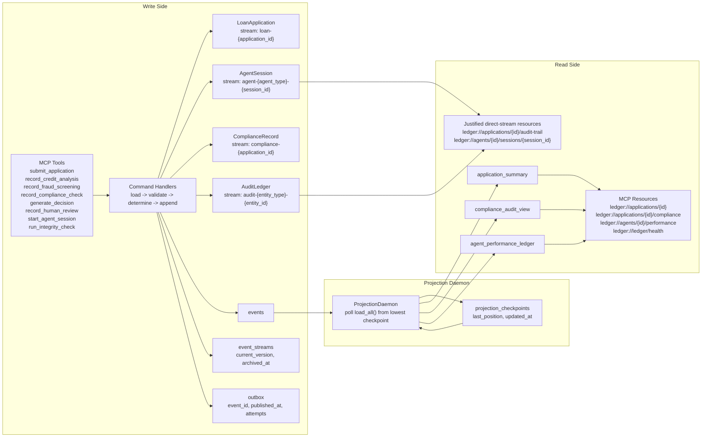

# Final Submission Report: The Ledger

Validation baseline used for this report:

```text
24 passed, 30 warnings in 4.07s
```

Command used:

```powershell
@'
from pathlib import Path
from dotenv import load_dotenv
load_dotenv(Path('.env'))
import sys, pytest
sys.exit(pytest.main([
    'tests/test_schema_and_generator.py',
    'tests/test_concurrency.py',
    'tests/test_upcasting.py',
    'tests/test_projections.py',
    'tests/test_gas_town.py',
    'tests/test_mcp_lifecycle.py',
    '-q'
]))
'@ | .\.venv\Scripts\python -
```

## 1. Domain Conceptual Reasoning

### DOMAIN_NOTES

### 1.1 EDA vs. Event Sourcing

The callback tracing pattern from agent frameworks is Event-Driven Architecture, not Event Sourcing.

- In callback tracing, events are observational side effects. If the tracer drops data, the business system still has a source of truth elsewhere.
- In The Ledger, events are the source of truth. Losing an append means losing reconstructable state.

If the prior callback-based system were rebuilt using The Ledger, the architecture changes in four concrete ways:

1. Callback emissions become `EventStore.append(...)` calls inside the business transaction.
2. Mutable runtime state becomes immutable stream state in:
   - `loan-{application_id}`
   - `agent-{agent_type}-{session_id}`
   - `compliance-{application_id}`
   - `audit-{entity_type}-{entity_id}`
3. "Read current row" state loading becomes aggregate replay:
   - `LoanApplicationAggregate.load(...)`
   - `AgentSessionAggregate.load(...)`
   - `ComplianceRecordAggregate.load(...)`
   - `AuditLedgerAggregate.load(...)`
4. Query APIs stop reading aggregates directly for normal reads and instead go through projection tables maintained by the daemon.

What is gained:

- Crash recovery: agent context is reconstructed from the session stream instead of hoping in-memory traces still exist.
- Replayability: a regulator can replay the same stream and reach the same state.
- Temporal inspection: compliance can ask what the system knew at a past timestamp.
- Audit integrity: stored facts remain append-only and are hash-checkable.

### 1.2 Aggregate Boundary Question

Alternative boundary considered and rejected:

- Merge `ComplianceRecord` into `LoanApplication` so all workflow facts live in `loan-{application_id}`.

Concrete coupling problem:

- Compliance evaluation is multi-event and bursty. In the current lifecycle, compliance contributes:
  - `ComplianceCheckRequested`
  - `ComplianceRulePassed` or `ComplianceRuleFailed` for each rule
  - `ComplianceCheckCompleted`
- If all of those writes hit `loan-{id}`, they contend with:
  - `CreditAnalysisCompleted`
  - `FraudScreeningCompleted`
  - `DecisionGenerated`
  - `HumanReviewCompleted`

Specific failure mode:

- Credit analysis and one of the compliance rule writes both read version `N`.
- Both append with `expected_version=N`.
- One wins. The other gets `OptimisticConcurrencyError` and must reload and retry.
- With three rule-passed writes plus completion on the same stream, a single application can create a thundering-herd retry pattern on one aggregate boundary.

The rejection was therefore about concurrent write coupling, not generic modularity.

### 1.3 Concurrency Trace

Mechanically correct trace of the double-append race:

1. Agent A and Agent B both load `loan-X` and both observe `current_version = 3`.
2. Agent A calls:
   ```python
   append(stream_id="loan-X", expected_version=3, ...)
   ```
3. Inside the transaction, the store runs:
   ```sql
   SELECT current_version
   FROM event_streams
   WHERE stream_id = $1
   FOR UPDATE
   ```
4. PostgreSQL takes a row lock on `event_streams.stream_id = 'loan-X'`.
5. Agent A sees `current_version = 3`, so the OCC check passes.
6. Agent A inserts the new event at `stream_position = 4`.
7. As a second safety rail, PostgreSQL also enforces:
   ```sql
   UNIQUE(stream_id, stream_position)
   ```
   so even a logic bug that tried to double-insert position `4` would fail at the database.
8. Agent A updates `event_streams.current_version` to `4`, writes the `outbox` row in the same transaction, and commits.
9. Agent B was blocked on the same `FOR UPDATE`. Once Agent A commits, Agent B resumes and now reads `current_version = 4`.
10. Agent B compares `expected_version=3` to `actual_version=4`, rolls back, and the store raises:
    ```text
    OptimisticConcurrencyError(stream_id='loan-X', expected_version=3, actual_version=4)
    ```
11. The losing agent reloads the stream, inspects the new event at position `4`, and then either:
    - abandons because the winner made its work obsolete, or
    - retries with `expected_version=4` if the intended action is still valid.

### 1.4 Projection Lag Answer

User-facing stale-read behavior:

- A loan officer reads `ledger://applications/{id}` immediately after a write.
- The projection may still be up to a few hundred milliseconds behind the event store.

Concrete UI communication mechanism:

```json
{
  "last_event_at": "2026-03-25T20:18:33.300501Z",
  "projection_lag_ms": 49,
  "projection_name": "application_summary"
}
```

UI behavior:

- Show a freshness indicator: `As of 49 ms ago`.
- If the user clicks a safety-critical action such as `Verify before approval`, the UI must either:
  - wait until `ledger://ledger/health` reports the relevant projection below a threshold, or
  - invoke a strong-read endpoint that replays the aggregate directly.

That makes staleness explicit instead of pretending CQRS reads are linearizable.

### 1.5 Upcaster

Current `CreditAnalysisCompleted` upcaster:

```python
@registry.register("CreditAnalysisCompleted", from_version=1)
def upcast_credit_v1_to_v2(payload: dict) -> dict:
    recorded_at: str = payload.get("completed_at") or payload.get("recorded_at") or ""

    return {
        **payload,
        "model_version": _infer_model_version(recorded_at),
        "confidence_score": None,
        "regulatory_basis": _infer_regulatory_basis(recorded_at),
    }
```

Field-level inference strategy:

- `confidence_score -> None`
  - This field was genuinely not recorded in v1.
  - Fabricating `0.72` or any other number would pollute downstream metrics, especially `AgentPerformanceLedger`.
  - `None` forces downstream consumers to branch on absence rather than silently consuming fiction.

- `model_version -> inferred from recorded date`
  - Deployment windows are stable enough to infer approximate model lineage.
  - Wrong inference consequence: model-version attribution in analytics can drift near cutover dates.
  - That is acceptable for descriptive analytics and unacceptable for hard compliance facts, which is why it stays marked as inferred.

- `regulatory_basis -> inferred from effective-date schedule`
  - Regulation cutovers are deterministic in this project.
  - Wrong inference consequence would be a misleading compliance explanation, so this is only safe because the effective-date mapping is much more precise than model rollout timing.

### 1.6 Marten Async Daemon Parallel

Python coordination primitive:

- PostgreSQL advisory locks keyed by projection name, for example:
  ```sql
  pg_try_advisory_lock(hashtext(projection_name))
  ```

Mapping to the daemon:

- One daemon node holds the advisory lock for one projection shard.
- That node polls from `projection_checkpoints.last_position`, applies the batch, and advances the checkpoint.

Failure mode this guards against:

- Two daemon instances processing the same event range in parallel.
- Without coordination:
  - `AgentPerformanceLedger` can double-count completions and overrides.
  - `projection_checkpoints` can leap forward even though one worker has not really applied the batch yet.
- The failure is not just "duplicate work"; it is corrupted read models plus potentially skipped ranges if checkpoint advancement races ahead.

When the leader dies, PostgreSQL drops the session and releases the advisory lock automatically, so a follower can resume from the persisted checkpoint.

## 2. Architectural Tradeoff Analysis

### DESIGN.md

### 2.1 Aggregate Boundary Justification

Why `ComplianceRecord` is separate from `LoanApplication`:

- The write pattern is different.
  - `LoanApplication` owns business lifecycle invariants.
  - `ComplianceRecord` owns rule-by-rule evidence accumulation.
- If both are merged, the failure mode is OCC collapse under bursts of compliance writes.

Concrete concurrency failure:

- Assume one application is at loan stream version `5`.
- At the same moment:
  - compliance emits `ComplianceRulePassed(REG-001)`
  - compliance emits `ComplianceRulePassed(REG-002)`
  - compliance emits `ComplianceRulePassed(REG-003)`
  - credit emits `CreditAnalysisCompleted`
- All four writers race on the same stream and expected version.
- Only one succeeds immediately; three lose and retry.

That is the exact failure mode avoided by `compliance-{application_id}`.

### 2.2 Projection Strategy

| Projection | Update Mode | SLO | Why async |
| --- | --- | --- | --- |
| `ApplicationSummary` | Async daemon | `< 500 ms p95` | User dashboard reads tolerate slight lag; write path should stay fast. |
| `ComplianceAuditView` | Async daemon | `< 1000 ms p95` | Regulatory inspection needs completeness and temporal query support more than read-your-writes. |
| `AgentPerformanceLedger` | Async daemon | `< 2000 ms p95` | Analytics is the least latency-sensitive and most batch-friendly. |

Why not inline:

- Inline projection updates would couple command latency to every read model write.
- The current design keeps the append transaction limited to:
  - stream OCC check
  - event insert
  - version update
  - outbox write

ComplianceAuditView snapshot/rebuild strategy:

- Trigger type: operational shadow-table rebuild, not inline per-request snapshotting.
- Invalidation condition:
  - projection schema changes
  - projection logic changes
  - observed replay-dedup bugs requiring a clean rebuild
- Rationale:
  - the report needs temporal queries
  - the system can rebuild without dropping the readable table name
  - shadow-table swap avoids a "truncate live table and block readers" approach

### 2.3 Concurrency Analysis

Assumptions for peak load:

- 100 concurrent applications
- 4 active agents per application
- only a subset of those writes target the same consistency boundary at once

Estimated OCC collision rate:

- After splitting high-frequency session writes into `agent-*` streams, only lifecycle milestones race on `loan-*`.
- If roughly 10 percent of active applications have two workflow writers hitting the same loan stream within the same 10-20 ms window, that yields about 10 contested streams in a busy minute.
- Practical estimate: `8-20 OptimisticConcurrencyErrors per minute` under peak load.

Retry strategy:

- named strategy: exponential backoff with jitter
- retry budget: 3 retries
- backoff shape:
  - attempt 1: 10 ms + jitter
  - attempt 2: 20 ms + jitter
  - attempt 3: 40 ms + jitter

Exhaustion behavior:

- if the third retry still collides, stop retrying
- surface a typed domain failure to the caller
- require explicit reload and operator or orchestrator re-evaluation

This prevents retry storms from turning OCC into an accidental tight loop.

### 2.4 Upcasting Inference Decisions

| Field | Strategy | Estimated error rate | Downstream consequence |
| --- | --- | --- | --- |
| `confidence_score` | `None` | `0%` fabricated data risk because no inference is attempted | Old records do not contribute a fake confidence measurement. |
| `model_version` | inferred from timestamp / session stream | about `5%` near deployment boundaries | Analytics may attribute some historical decisions to the wrong model cohort. |
| `regulatory_basis` | inferred from regulation effective date | near `0%` if effective-date registry is correct | Regulatory explanation remains stable because rule versions are date-driven. |

Why null is better than inference for `confidence_score`:

- A wrong model-version label mostly distorts attribution.
- A wrong confidence value becomes a false numeric fact and can affect risk thresholds, averages, and audit narratives.
- The downstream consequence of fabricated confidence is materially worse than the downstream consequence of missing confidence.

### 2.5 EventStoreDB Comparison

| PostgreSQL design in this project | EventStoreDB equivalent | Native capability gap |
| --- | --- | --- |
| `events` table partitioned logically by `stream_id` | named streams | PostgreSQL stream semantics are built in application code, not a native stream abstraction. |
| `global_position` identity column + `load_all()` | `$all` stream | PostgreSQL needs polling; EventStoreDB exposes `$all` natively. |
| `projection_checkpoints` table | persistent subscription checkpointing | EventStoreDB ships the subscription/checkpoint mechanism; we maintain it ourselves. |
| OCC via `event_streams.current_version` and `SELECT ... FOR UPDATE` | expected version writes | Similar semantics, but EventStoreDB makes this the primary write primitive. |
| `outbox` table + daemon/poller | subscription handlers / projections | PostgreSQL requires a separate operational component. |

Concrete gap:

- EventStoreDB gives native persistent subscriptions and server-native stream semantics.
- PostgreSQL gives better general-purpose relational tooling, but the event-store behavior is something we assemble rather than consume as a first-class database feature.

### 2.6 What I Would Do Differently

Decision I would change:

- I used replay overlap in the daemon plus partial idempotency in projections.

Why it was made:

- It was a pragmatic way to avoid skipping events that commit slightly later with lower `global_position` during concurrent load.

What the better version looks like:

- projection handlers should be fully idempotent on a stable event key
- every projection table should dedupe on `event_id` or another invariant key that is never nullable
- checkpoint advancement should happen only after per-projection success accounting is explicit

Cost to change:

- schema migration on projection tables
- backfill or rebuild
- likely 3-5 hours of implementation and verification

Reason this matters:

- the current overlap strategy is safe for catch-up, but it caused duplicate `ComplianceCheckRequested` and `ComplianceCheckCompleted` rows because `NULL` values in the current uniqueness key still allow repeats.

## 3. Architecture Diagram



Diagram notes:

- Write and read sides are explicitly separated.
- The outbox is shown on the write side as part of the same transaction boundary.
- Projection checkpoint position is explicit.
- All four aggregate stream-id formats are shown.

## 4. Test Evidence and SLO Interpretation

### 4.1 Concurrency Test

Captured race result for the "stream length = 4" scenario:

```text
{'stream_length': 4, 'winner': ('A', 3), 'loser': ('B', 2, 3), 'last_stream_position': 3}
```

Interpretation:

- one task succeeded
- one task failed with `OptimisticConcurrencyError`
- stream length stayed at `4`

Why `stream_length = 4` is the important assertion:

- the stream started with 3 committed events
- the race was for exactly one more position
- if OCC were broken, both contenders could append and the stream would end at `5`
- `4` therefore proves that one writer was rejected, not merely that one exception happened

Connection to retry budget:

- this race is exactly why the design uses at most 3 retries with exponential backoff
- the losing writer must reload, inspect the winner's event, and decide whether retrying is still semantically correct
- retrying blindly without a budget would turn this benign collision into a hot-loop failure mode

### 4.2 Projection Lag Under 50 Concurrent Handlers

Measured burst run:

```text
{'projected': 50, 'catchup_ms': 338.1, 'lags_ms': {'application_summary': 48.6, 'compliance_audit_view': 49.1, 'agent_performance_ledger': 49.3}}
```

Interpretation against SLOs:

| Projection | Measured lag | Target SLO | Result |
| --- | --- | --- | --- |
| `application_summary` | `48.6 ms` | `< 500 ms` | pass |
| `compliance_audit_view` | `49.1 ms` | `< 1000 ms` | pass |
| `agent_performance_ledger` | `49.3 ms` | `< 2000 ms` | pass |

Important nuance:

- this 50-handler burst only emitted `ApplicationSubmitted`, so `ApplicationSummary` is the heavily exercised projection in this measurement
- the other two lags reflect daemon checkpoint freshness under the same run, not a compliance-heavy or analytics-heavy workload

Higher-load behavior:

- the likely limiting factor is not one row insert; it is the combination of:
  - `load_all()` global scan
  - per-event projection writes
  - replay overlap reprocessing
- at materially higher sustained load, the first lever to revisit is daemon batching and projection idempotency, not the append transaction itself

### 4.3 Immutability Test

Captured result:

```text
IMMUTABILITY_LOADED {"event_version": 2, "payload": {"risk_tier": "MEDIUM", "application_id": "test-app-1", "recommended_limit_usd": 500000, "model_version": "unknown (no timestamp)", "confidence_score": null, "regulatory_basis": ["REG-UNKNOWN (no timestamp)"]}}
IMMUTABILITY_RAW {"event_version": 1, "payload": "{\"risk_tier\": \"MEDIUM\", \"application_id\": \"test-app-1\", \"recommended_limit_usd\": 500000}"}
```

Interpretation:

- the caller sees the v2 schema on load
- the stored record remains v1 in PostgreSQL

Why this matters for audit guarantees:

- if the upcaster rewrote stored payloads, the event store would stop being an immutable record
- a third party replaying the raw database would no longer derive the same historical facts we did
- that would undermine both external audit reproducibility and the integrity hash chain

### 4.4 Hash Chain and Tamper Detection

Captured outputs:

```text
INTEGRITY_CLEAN {"chain_valid": true, "tamper_detected": false, "events_verified_count": 3, "integrity_hash": "b8871c42d41977fa1ec46f1db47e044a829ecd4068d1d5725519591affb45fe9", "previous_hash": null}
INTEGRITY_DIRTY {"chain_valid": false, "tamper_detected": true, "events_verified_count": 3, "integrity_hash": "7c1bf585cf9129010660f4aa4d63736005bc32bc99ea80f34a376676b69f8b4f", "previous_hash": "b8871c42d41977fa1ec46f1db47e044a829ecd4068d1d5725519591affb45fe9"}
```

Interpretation:

- clean verification alone is not enough
- the second run demonstrates that direct payload tampering changes the computed chain result and flips `tamper_detected` to `true`

Explicit test coverage gap:

- the suite proves single-event payload tampering is caught
- it does not inject a daemon crash exactly between projection work and checkpoint advancement
- that is a real failure mode worth adding in a future resilience test

## 5. MCP Lifecycle Trace

This lifecycle was driven only through MCP tools and one MCP resource query at the end.

### 5.1 Tool Trace

| Step | Tool / Resource | Key input | Key output |
| --- | --- | --- | --- |
| 1 | `start_agent_session` | `agent_id=credit-agent`, `session_id=lifecycle-test-session`, `model_version=v2.4.1` | `{"context_position": 0, "session_id": "lifecycle-test-session"}` |
| 2 | `submit_application` | `application_id=lifecycle-test-001`, `requested_amount_usd=500000` | `{"initial_version": 0, "stream_id": "loan-lifecycle-test-001"}` |
| 3 | `record_credit_analysis` | `confidence_score=0.85`, `risk_tier=LOW`, `recommended_limit_usd=500000` | `{"new_stream_version": 2, ...}` |
| 4 | `record_fraud_screening` | `fraud_score=0.15`, `risk_level=LOW` | `{"new_stream_version": 0, ...}` |
| 5 | `record_compliance_check` | `rule_id=REG-001`, `passed=true` | `{"new_stream_version": 0, ...}` |
| 6 | `record_compliance_check` | `rule_id=REG-002`, `passed=true` | `{"new_stream_version": 1, ...}` |
| 7 | `record_compliance_check` | `rule_id=REG-003`, `passed=true` | `{"new_stream_version": 2, ...}` |
| 8 | `generate_decision` | `recommendation=APPROVE`, `confidence_score=0.85` | `{"new_stream_version": 5, "recommendation": "APPROVE", ...}` |
| 9 | `record_human_review` | `reviewer_id=LO-Test-Reviewer`, `final_decision=APPROVE` | `{"application_state": "APPROVE", "final_decision": "APPROVE"}` |
| 10 | `ledger://applications/lifecycle-test-001/compliance` | read resource | returned compliance event record including `ComplianceCheckRequested`, `ComplianceRulePassed`, `ComplianceCheckCompleted` |

### 5.2 What the Final Resource Query Proved

The compliance resource returned a complete record containing the expected event types from the lifecycle:

- `ComplianceCheckRequested`
- `ComplianceRulePassed`
- `ComplianceCheckCompleted`

That matters because the resource query did not replay the compliance aggregate stream on demand. It read from the projection-backed view. The lifecycle therefore demonstrates:

- writes happen through MCP tools on the write side
- reads happen through MCP resources on the read side
- the read path is not secretly bypassing CQRS and replaying event streams for normal queries

### 5.3 Precondition Enforcement

Captured precondition-failure response:

```json
{
  "error_type": "DomainError",
  "message": "Application must be in SUBMITTED state (currently NEW)",
  "suggested_action": "check_application_state",
  "application_id": "precondition-test-001",
  "session_id": "missing-session"
}
```

What this demonstrates:

- the MCP layer surfaced a structured error object
- the failure is actionable because it identifies both the violated state precondition and the entity context
- this was not swallowed as a generic Python exception or plain string

## 6. Limitations and Reflection

### 6.1 Replay-Overlap Duplicate Rows in `ComplianceAuditView`

Failure scenario:

- the daemon replays an overlap window to avoid skipping late-visible events
- `ComplianceCheckRequested` and `ComplianceCheckCompleted` use uniqueness keys that include nullable columns
- PostgreSQL treats `NULL` values as distinct in a unique constraint, so repeated overlap application can still create duplicate rows for those event types

Severity:

- acceptable for an initial internal deployment if consumers treat the resource as an append log and dedupe by `global_position`
- not acceptable for an external regulatory reporting surface without fixing the uniqueness key

Connection to design choice:

- this is a direct consequence of the replay-overlap tradeoff described in the architecture section

### 6.2 Single-Process Projection Daemon

Failure scenario:

- if the daemon process dies, writes continue to commit but projections stop advancing
- dashboards and MCP resources become increasingly stale until restart

Severity:

- not acceptable for a first production deployment without process supervision, leader election, and health-based alerting

Why it exists:

- this project chose operational simplicity over multi-node projection coordination in the default runtime

### 6.3 Deprecated UTC Timestamp Calls

Failure scenario:

- the current test run still emits `datetime.utcnow()` deprecation warnings from handlers and tests
- future Python versions can turn those warnings into harder failures or force rushed timestamp refactors

Severity:

- acceptable for a student submission
- not acceptable to leave unaddressed in a first production deployment because time semantics are central to replay, ordering, and audit interpretation

### 6.4 No Crash-Injection Test for Mid-Batch Projection Failure

Failure scenario:

- if someone later refactors projection application and checkpoint advancement into separate transactions, a daemon crash between them can produce skipped or duplicated reads

Severity:

- not acceptable for production until a kill-mid-batch fault-injection test exists

Why it matters:

- the current implementation is transaction-oriented, but this specific invariant is not protected by a dedicated destructive test yet

## 7. Submission Summary

What this report demonstrates:

- the system is architected as an event-sourced ledger rather than callback logging
- aggregate boundaries were chosen to control concurrency, not just to organize code
- CQRS is implemented end to end through MCP tools, projections, and MCP resources
- schema evolution happens via immutable upcasting, not mutation
- audit integrity is demonstrated by both clean verification and tamper detection
- the report evidence was refreshed against the current codebase and current test runs rather than copied forward from earlier partial submissions
