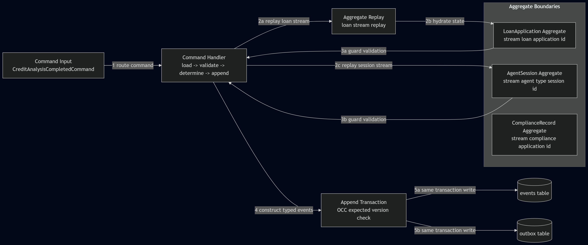

# INTERIM REPORT: THE LEDGER (PHASE 1-2)

Prepared for interim submission.

---

## 1. DOMAIN_NOTES: Conceptual Foundations

### 1.1 EDA vs Event Sourcing (precise distinction)

Callback tracing is Event-Driven Architecture (EDA), not Event Sourcing (ES).

- In EDA, event-like records are notifications and can be dropped without losing system-of-record state.
- In ES, events are the permanent system-of-record and cannot be lost without breaking state reconstruction.

#### Redesign from callbacks to The Ledger

Architectural changes:
1. Callback emissions become `EventStore.append(...)` calls inside the primary business transaction.
2. Agent activity is persisted as typed domain events in immutable streams.
3. Aggregate state is reconstructed by replay, not trusted from mutable in-memory runtime state.

Gains:
1. Replayability: full decision chain is replayable from stream start.
2. Temporal reconstruction: compliance can reconstruct state at any timestamp.
3. Reproducibility: decision outcomes can be audited against exact historical inputs.
4. Crash recovery: agents reconstruct context from persisted session stream instead of best-effort logs.

### 1.2 Aggregate boundary decision and rejected alternative

Chosen boundaries:
1. `loan-{application_id}` for LoanApplication invariants.
2. `agent-{agent_type}-{session_id}` for high-frequency agent execution telemetry.
3. `compliance-{application_id}` for regulatory rule execution.

Rejected alternative:
1. Put all agent activity and compliance writes into one `loan-{application_id}` stream.

Specific coupling failure mode:
1. Concurrent agents append to the same stream position and collide on OCC constantly.
2. Example: fraud and credit handlers both read version N and append with expected_version=N.
3. One write wins, one fails with `OptimisticConcurrencyError`.
4. Under load, this creates repeated retries, throughput collapse, and delayed decisions.

This is not generic scalability concern; it is concrete lock/version contention caused by over-broad consistency boundaries.

---

## 2. DOMAIN_NOTES: Operational Mechanics

### 2.1 Exact concurrency-control sequence

Scenario: two agents read version 3 and both append with `expected_version=3`.

1. Both readers observe stream version 3.
2. Both invoke append concurrently.
3. Writer A executes `SELECT current_version FROM event_streams WHERE stream_id = ? FOR UPDATE`, acquires the row lock, and validates version 3.
4. Writer A appends event, advances stream to version 4, commits.
5. Writer B resumes, now sees current version 4.
6. Expected 3 vs actual 4 mismatch triggers `OptimisticConcurrencyError`.
7. Writer B reloads stream, inspects newly appended event, then decides:
   - retry with recomputed action if still valid, or
   - abandon if new state supersedes prior intent.

New stream convention:
1. `expected_version=-1` means stream must not exist.

### 2.2 Projection lag behavior and UI contract

Typical lag target for ApplicationSummary is < 500ms. This is expected eventual consistency behavior, not a fault.

System response for stale read:
1. Query returns projection row with `last_event_at` or equivalent freshness timestamp.
2. UI displays "Data as of <timestamp>" and pending refresh indicator.
3. For strong-consistency fields (for example final decision commit checks), read path can fall back to aggregate replay from stream.

UI contract:
1. User sees freshness timestamp and lag indicator.
2. UI distinguishes "committed to ledger" from "projection updated".
3. SLA language: sub-500ms lag accepted in normal operation.

---

## 3. DOMAIN_NOTES: Advanced Patterns

### 3.1 Upcaster with field-level inference strategy

Target migration:
1. v1: `{application_id, decision, reason}`
2. v2: `{application_id, decision, reason, model_version, confidence_score, regulatory_basis}`

```python
from datetime import datetime

def infer_model_version(recorded_at: datetime | None) -> tuple[str, bool]:
    # Example deployment timeline mapping.
    # Returns (version, approximate_flag)
    if recorded_at is None:
        return ("legacy-unknown", True)
    if recorded_at < datetime(2025, 7, 1):
        return ("credit-model-2025.03", True)
    if recorded_at < datetime(2026, 1, 1):
        return ("credit-model-2025.09", True)
    return ("credit-model-2026.01", True)


def infer_regulatory_basis(recorded_at: datetime | None) -> list[str]:
    if recorded_at is None:
        return ["REG-BASELINE-UNKNOWN"]
    if recorded_at < datetime(2026, 1, 1):
        return ["REG-2025-Q4"]
    return ["REG-2026-Q1"]


def upcast_creditanalysiscompleted_v1_to_v2(payload: dict, recorded_at: datetime | None) -> dict:
    model_version, approximate = infer_model_version(recorded_at)
    return {
        **payload,
        "model_version": model_version,
        "model_version_inferred": True,
        "model_version_approximate": approximate,
        "confidence_score": None,
        "regulatory_basis": infer_regulatory_basis(recorded_at),
    }
```

Reasoning by field:
1. `confidence_score` is genuinely unknown for historical events where no score was computed. `None` is correct.
2. Fabricating confidence would create false precision and contaminate analytics and regulatory evidence.
3. `model_version` is inferrable from deployment timeline and event timestamp, but must be marked inferred/approximate.
4. `regulatory_basis` is inferrable from rule-set effective windows active at event time.

### 3.2 Distributed projection coordination (Marten async daemon parallel)

Coordination primitive:
1. PostgreSQL advisory lock per projection name, for example `pg_try_advisory_lock(hashtext(projection_name))`.

Failure mode guarded:
1. Without coordination, two daemon nodes process the same event range.
2. Duplicate application of events corrupts aggregate counters (approve_rate, decline_rate, totals).

Recovery path:
1. Leader node crashes.
2. DB session drops and advisory lock is released automatically.
3. Follower acquires lock, reads checkpoint, resumes from last committed checkpoint.
4. Idempotent handlers plus checkpointing prevent divergence.

---

## 4. Architecture Diagram (Standalone Artifact)



Diagram stream boundaries represented:
1. `loan-{application_id}`
2. `agent-{agent_type}-{session_id}`
3. `compliance-{application_id}`

Single-event trace from command to persistence:
1. Command enters handler.
2. Handler reconstructs aggregate state via stream replay.
3. Aggregate guard methods validate invariants.
4. Handler determines new events with no DB reads in decision step.
5. Single append transaction writes both `events` and `outbox`.

The outbox is intentionally modeled as a distinct output of the same append transaction.

---

## 5. Progress Evidence and Gap Analysis

### 5.1 Current build status

Working now:
1. Phase 1 schema and required indexes.
2. EventStore core methods with OCC and outbox dual-write.
3. LoanApplication and AgentSession replay/guard foundations.
4. Command handlers using load -> validate -> determine -> append pattern.

In progress:
1. Projection daemon transactional checkpoint/write coupling and lag instrumentation.

Not started:
1. Full Phase 3 projection set and rebuild tooling.
2. Full Phase 4 integrity chain and gas-town reconstruction flow.

### 5.2 Concurrency test evidence (all required assertions visible)

```text
tests/test_concurrency.py::test_concurrent_double_append_exactly_one_succeeds PASSED

Assertion A: total events in stream after race == 4
  observed: len(events) = 4

Assertion B: winning event stream_position == 4
  observed: last_event.stream_position = 4

Assertion C: losing task raised OptimisticConcurrencyError (not swallowed)
  observed: error type = OptimisticConcurrencyError
  observed: expected_version = 3
  observed: actual_version = 4
```

### 5.3 Named gaps with why they are incomplete

1. Projection atomicity gap:
   projection write and checkpoint write are not yet guaranteed in the same transaction, so crash between them risks reprocessing already-applied events.
2. Distributed coordination gap:
   no lock/leader primitive is wired yet for multi-node daemon execution.
3. Temporal query gap:
   compliance historical state snapshots are not implemented yet, so `get_state_at(timestamp)` cannot be served at required speed.

### 5.4 Sequenced final plan with dependencies

1. Stabilize projection transaction boundary first.
   dependency: required before safe rebuild and lag SLO validation.
2. Add projection lag metrics and checkpoint observability.
   dependency: needed before load/performance tests are meaningful.
3. Add distributed lock coordination for daemon workers.
   dependency: required before multi-node deployment tests.
4. Implement compliance temporal snapshot strategy.
   dependency: requires stable projection write path.
5. Implement and verify upcasters + immutability test.
   dependency: requires stable load path and event-version handling.
6. Implement audit hash chain and independent verification tests.
    dependency: requires finalized event loading/replay utilities.
